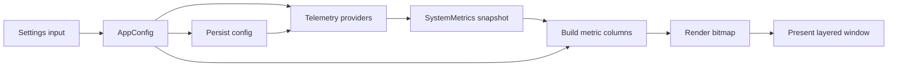

# Function-Level Task and I/O Contract

- **Parent task plan:** [`task-breakdown.md`](task-breakdown.md)
- **Feature baseline:** [`original-feature-catalog.md`](original-feature-catalog.md)
- **Original source revision:** `c1173f9ecce858931f694661457ef2b905696da4`
- **State:** implementation is tracked per phase below; Phase 1 PoT contracts F1-01–F1-13 have PoT implementation code where applicable; Windows runtime acceptance is pending. F1-07/F1-08 cover only the PoT menu, not the full application command set.
- **No-.NET rule:** these are Rust function contracts derived by reading original source. No original program is built or run to define them.

## Contract rule

Match the original program's externally observable input/output behavior and data meanings. Rust may use safer internal types (`Option`, `Result`) than C#, but the adapter between layers must preserve the original display, persistence, and interaction results. Do not carry the original C#'s silent exception swallowing into every Rust function: return typed errors internally, then convert them to the same fallback behavior at the UI boundary.

## Original data contract

### Telemetry output

The original `TelemetryService.UpdateMetrics()` builds a new `SystemMetrics` every poll and emits it through `MetricsUpdated(SystemMetrics)`. Its equivalent Rust output must preserve these fields, meanings, and units:

| Original output field | Rust equivalent | Type / unit | Original fallback and display behavior |
|---|---|---|---|
| `CpuUsage` | `cpu_usage_percent` | `f32`, percent 0–100 | Overlay truncates to integer and adds `%`. |
| `RamPercent` | `ram_percent` | `f32`, used physical memory percent | Overlay truncates to integer and adds `%`. |
| `GpuUsage` | `gpu_usage_percent` | `f32`, percent 0–100 | Overlay truncates to integer and adds `%`; unavailable reads currently settle to 0 through provider fallback. |
| `GpuTemperature` | `gpu_temperature_c` | `Option<f32>` internally; view adapter maps unavailable to sentinel `-1.0` | Overlay displays integer Celsius when >0; otherwise `N/A`. |
| `NetUpKbps` / `NetDownKbps` | `net_up_kbps` / `net_down_kbps` | `f32`, KiB/s as computed from bytes ÷ 1024 ÷ seconds, despite the legacy `Kbps` name | Deltas below zero are clamped to 0 after counter reset/reconnect. |
| `NetUpText` / `NetDownText` | `net_up_text` / `net_down_text` | `String` | Exact `FormatNet` behavior: KB/s, MB/s, GB/s with threshold-specific precision. |
| `DiskUsage` | `disk_usage_percent` | `f32`, max selected-disk activity percent | Aggregate max activity; not the value shown for each drive. |
| `DiskPercent` | `disk_used_percent` | `f32`, aggregate used-space percent across ready selected drives | 0 when no ready drive capacity was measured. |
| `Disks[]` | `disks: Vec<DiskMetric>` | Per-drive sequence | Each item preserves source instance name, per-drive used-space percentage, and capped activity percentage. |

Equivalent disk item:

```rust
struct DiskMetric {
    name: String,                 // e.g. "0 C:"
    space_percent: f32,           // used space 0..100
    activity_percent: f32,        // disk activity 0..100
}
```

### Configuration input

Rust config values should use the original JSON property names when importing/exporting the compatibility model. These original defaults must be retained unless a setting is explicitly changed:

| Setting group | Original properties/defaults relevant to functions |
|---|---|
| Visibility/lifecycle | `ShowOverlay=true`, `LaunchOnStartup=false`, `LockPosition=false`, `HideOnFullscreen=true`, `StickToTaskbar=true`, `AlwaysOnTop=true` |
| Sensors | CPU/RAM/GPU/GPU temp/disk/disk activity/network up/down enabled; `NetworkAdapter="Default"`, `GpuAdapter="Default"`, `SelectedDisks="All"` |
| Poll/render | `UpdateInterval=1000` ms, `DisplayStyle="Text"`, `ShowPods=true`, `ShowBackground=false`, `ScaleFactor=1.0`, `ColumnSpacing=6`, `IsTextBold=true` |
| Appearance | `FontFamily="Segoe UI"`, accent `#FFFFFF`, label `#00CCFF`, background `#B4141414`, capsule `#0FFFFFFF`; per-section colors unset/inherit |
| Position | `X=100`, `Y=100` before taskbar alignment |

When a setting changes, the original property-changed handler saves the full config immediately; `LaunchOnStartup` also updates the per-user Run registry entry. Context-menu toggles explicitly save after changing the setting. Rust event handling must produce the same persistent state after the interaction completes.

## Input/output pipeline



`SystemMetrics` is the telemetry-to-overlay boundary. Keep it separate from provider errors and UI-specific labels; convert provider states to the source-compatible fallback at this boundary.

## Function-level implementation tasks

### Phase 0 — Contracts and workspace

| Function task | Planned Rust function/type | Input | Output / side effect | Original mapping / acceptance |
|---|---|---|---|---|
| F0-01 | `validate_catalog_traceability() -> Result<TraceMap, Vec<MissingRequirement>>` | 35 original IDs and task definitions | Complete ID → function task → verification map | Every original catalog ID has implementation owner and output assertion. |
| F0-02 | `load_source_derived_decisions() -> Vec<PortDecision>` | Baseline SHA and documented discrepancies | Explicit decisions for disk cap/layout, taskbar scope, display modes | Decision list agrees with `original-feature-catalog.md`; no original runtime call. |
| F0-03 | `check_rust_only_workflow(workflow: &str) -> Vec<PolicyViolation>` | CI/build workflow text | Reports .NET setup/commands or original executable references | Unit test rejects `dotnet` setup/invocations in project-owned workflow. |

### Phase 1 — Window and renderer proof of technology

| Function task | Planned Rust function | Input | Output / side effect | Original mapping / acceptance |
|---|---|---|---|---|
| F1-01 | `register_overlay_class(instance: HINSTANCE) -> Result<WindowClass, WinError>` | Process instance, window procedure | Registered class handle/token | `OverlayWindow` constructor; can register once and safely unregister at shutdown. |
| F1-02 | `create_overlay_window(class: &WindowClass, config: &AppConfig) -> Result<OverlayHandle, WinError>` | Initial `X/Y`, window class, style | Native overlay HWND | Original creates popup layered/tool/topmost window; no taskbar button; size is updated after layout. |
| F1-03 | `make_overlay_bitmap(frame: &OverlayFrame) -> Result<PremultipliedBitmap, RenderError>` | Layout, colors, font, capsule/background/hover config | 32-bit premultiplied-alpha bitmap | Original `UpdateLayer` GDI+ drawing input and dimensions; transparent pixels remain transparent. |
| F1-04 | `present_layered_window(hwnd: HWND, bitmap: &PremultipliedBitmap, position: Point, alpha: u8) -> Result<(), WinError>` | HWND, bitmap, screen position, global alpha | Updates visible layered window | Original `SetBitmap(Bitmap)` → `UpdateLayeredWindow`; check coordinates and alpha. |
| F1-05 | `handle_overlay_message(hwnd: HWND, msg: u32, wparam: WPARAM, lparam: LPARAM, state: &mut OverlayState) -> LRESULT` | Native message and current config/state | Win32 return code plus state transition/message effect | Original `WndProc`; close is ignored, move/hover/menu/DPI events are handled. |
| F1-06 | `move_overlay(hwnd: HWND, target: Point, snap: SnapMode) -> Result<Point, WinError>` | Target point, current Snap/Lock settings, taskbar geometry | Actual position; writes final X/Y after move | Original `WM_WINDOWPOSCHANGING`, `WM_EXITSIZEMOVE`, `AlignToTaskbarCenter`. |
| F1-07 | `build_context_menu(config: &AppConfig, placement: WorkArea) -> ContextMenuModel` | Current check states and monitor work area | Menu items/checked states/above-or-below placement | Original `WM_RBUTTONUP`; exact commands and vertical placement rule preserved. |
| F1-08 | `handle_context_command(command: ContextCommand, config: &mut AppConfig) -> Result<CommandEffect, AppError>` | Selected menu ID and mutable config | Setting mutation or launch/settings/exit effect | Original `TrackPopupMenuEx` command dispatch; toggle state is saved. |

### Phase 1 PoT implementation record (2026-09-28)

| Function task | Rust implementation | Status |
|---|---|---|
| F1-01 | `win32::run` registers a `WindowClass` and its window procedure. | Implemented; Windows execution pending. |
| F1-02 | `win32::run` creates a layered popup HWND; `WM_CLOSE`, right-click, and `WM_DESTROY` handle close/cleanup. | Implemented; Windows execution pending. |
| F1-03 | `bitmap::build_demo_bitmap` builds the premultiplied BGRA sample capsule and `RUST` glyphs. | Implemented; 2 deterministic bitmap tests pass. |
| F1-04 | `win32::present_bitmap` copies the surface into a top-down 32-bit DIB and calls `UpdateLayeredWindow` with per-pixel alpha. | Implemented and FFI type-checked; Windows visual acceptance pending. |
| F1-05 | `win32::window_proc` handles close, movement, DPI/display messages, menu, and test settings refresh. | Implemented; Windows message behavior pending. |
| F1-06 | `win32::attach_to_taskbar` / `detach_from_taskbar` center on the primary taskbar and retain a free X/Y. | Implemented; Windows snap/position acceptance pending. |
| F1-07 | `win32::show_context_menu` builds PoT Lock, Exit, Snap, and Settings entries. | Implemented; menu placement/interaction pending Windows. |
| F1-08 | PoT menu actions toggle lock/snap or open Settings/exit. | Implemented; persistence and full command catalog remain later work. |
| F1-13 | `bitmap::scale_bitmap` and `WM_DPICHANGED` resize/re-present the bitmap; display changes re-center the snapped window. | Implemented; multi-monitor acceptance pending Windows. |

The Win32 module can be type-checked on Linux using `cargo check -p system-monitor-windows --features win32-api-check --offline`. This does not link Windows libraries or replace the Windows run checklist.

### Phase 2 — Config, settings, and app lifecycle

| Function task | Planned Rust function | Input | Output / side effect | Original mapping / acceptance |
|---|---|---|---|---|
| F2-01 | `default_config() -> AppConfig` | None | Original defaults above | `AppConfig` initial values; exact property defaults match table. |
| F2-02 | `load_config(path: &Path) -> (AppConfig, LoadReport)` | Rust config path and optional compatible imported JSON | Validated config plus load/import status; no write to legacy source | `ConfigService.LoadConfig()` defaults on missing/corrupt file; Rust retains explicit diagnostic internally. |
| F2-03 | `save_config(path: &Path, config: &AppConfig) -> Result<(), ConfigError>` | Full current config | Atomic persisted JSON | `ConfigService.SaveConfig()` and property-change save; restart returns same values. |
| F2-04 | `import_legacy_config(legacy_json: &[u8]) -> Result<(AppConfig, ImportReport), ConfigError>` | Read-only original JSON bytes | Config values mapped by original names/defaults; source bytes unchanged | Original `config.json`; unknown fields reported, never overwrite source. |
| F2-05 | `apply_config_change(state: &mut AppState, change: ConfigChange) -> Result<ConfigEffects, AppError>` | User setting change, current app state | Updated config, save request, telemetry/render/startup side effects | Original `PropertyChanged` handlers and `SettingsWindow` bindings. |
| F2-06 | `set_startup_registration(enabled: bool, executable: &Path) -> Result<(), StartupError>` | Enabled state, Rust EXE path | Adds/removes Rust-specific HKCU Run value with `--startup` | `StartupService.SetStartup(bool)`; must not alter original app entry. |
| F2-07 | `acquire_single_instance(name: &str) -> Result<InstanceRole, InstanceError>` | Stable mutex/event name | Primary role or secondary activation request | `App.OnStartup`; one process only. |
| F2-08 | `handle_startup(args: &[OsString], role: InstanceRole) -> StartupAction` | Command-line arguments and mutex result | `ShowSettings`, `RunQuietly`, `ActivateExisting`, or `Exit` | Normal launch opens Settings; `--startup` does not; second launch activates original instance. |
| F2-09 | `navigate_settings(section: SettingsSection) -> SettingsViewState` | Section ID | Selected page and visibility state | `SettingsNav_SelectionChanged`, `SelectSection`, `HomeCard_Click`. |
| F2-10 | `set_selected_disks(selected: &[String]) -> Result<DiskSelection, ValidationError>` | Selected disk names | Persisted order and selected set (`All`, `None`, or explicit names) | `UpdateSelectedDisks`, `PopulateDiskList`, `EnsureValidSelections`. |
| F2-11 | `apply_theme(theme: ThemeName, config: &AppConfig) -> AppConfig` | Theme name/current config | New theme colors/font/weight; unrelated settings preserved | `ThemeCombo_SelectionChanged`; each of the ten theme presets checked field by field. |
| F2-12 | `reset_appearance(config: &AppConfig) -> AppConfig` | Current config | Appearance defaults, non-appearance config retained | `ResetToDefaults_Click`. |
| F2-13 | `reset_application(config: &AppConfig) -> AppConfig` | Current config after user confirms | All application defaults and startup disabled | `ResetApp_Click`; cancel path returns original config unchanged. |
| F2-14 | `shutdown_app(state: AppState) -> Result<(), ShutdownError>` | Active windows, timers, workers, providers, mutex | Clean resource release and process exit | `App.OnExit`, `App.Quit`, overlay/service `Dispose`. |

### Phase 3 — CPU, RAM, network, and disk functions

| Function task | Planned Rust function | Input | Output / side effect | Original mapping / acceptance |
|---|---|---|---|---|
| F3-01 | `enumerate_disks() -> Result<Vec<DiskDevice>, TelemetryError>` | Windows physical-disk/drive APIs | Sorted individual physical disk instances; excludes aggregate `_Total` | `GetAvailableDisks()`; original names such as `"0 C:"` retained for mapping. |
| F3-02 | `enumerate_gpus() -> Result<Vec<GpuDevice>, TelemetryError>` | WMI/Windows adapter enumeration | Unique device names plus stable IDs/LUID when available | `GetAvailableGpus()`; list order/name comparison. |
| F3-03 | `enumerate_network_adapters() -> Result<Vec<NetworkAdapter>, TelemetryError>` | Windows interface table | Sorted selectable active adapters | `GetAvailableNetworkAdapters()`; excludes down/loopback/tunnel/system pseudo adapters and transient `*` entries. |
| F3-04 | `is_selectable_adapter(adapter: &NetworkAdapter) -> bool` | Operational status/type/name/description | True for eligible Ethernet/Wi-Fi/Gigabit Ethernet; otherwise false | Original `IsSelectableAdapter(NetworkInterface)`. |
| F3-05 | `read_cpu_usage(state: &mut CpuCounterState) -> Result<f32, TelemetryError>` | Counter state and current Windows sample | Total CPU load percent | `UpdateMetrics()` CPU assignment; same 0–100 display field. |
| F3-06 | `read_ram_usage() -> Result<f32, TelemetryError>` | Global physical memory stats | `(total - available) / total * 100` | `UpdateMetrics()` RAM calculation. |
| F3-07 | `read_network_counters(selection: &AdapterSelection) -> Result<NetworkCounters, TelemetryError>` | Adapter list and `Default`/specific adapter selection | Cumulative sent/received bytes | `InitializeNetwork()`, `GetNetworkStats()`; Default aggregates all eligible adapters. |
| F3-08 | `calculate_network_rate(previous: NetworkCounters, current: NetworkCounters, elapsed: Duration) -> NetworkRate` | Previous/current byte counters and elapsed seconds | Nonnegative up/down KiB/s; counter decreases yield 0 | `UpdateMetrics()` delta calculation, divides by 1024 and seconds. |
| F3-09 | `format_network_rate(kib_per_second: f32) -> String` | Network rate in KiB/s | Exact human-readable rate | `FormatNet(float kbps)`; threshold and rounding below are preserved. |
| F3-10 | `read_disk_activity(selection: &[DiskDevice]) -> Result<Vec<DiskActivity>, TelemetryError>` | Selected physical-disk instances | Per-instance activity percent capped at 100 | `InitializeDisk()`, `UpdateMetrics()`, disk counter loop. |
| F3-11 | `read_drive_space(disk: &DiskDevice) -> DriveSpace` | Physical instance name and drive free/total bytes | Per-drive used percent or unavailable | `UpdateMetrics()` `DriveInfo` mapping; denominator is total drive size. |
| F3-12 | `aggregate_disk_metrics(items: &[DiskMetric]) -> (f32, f32)` | Selected drive metrics | `(max activity, aggregate used-space percent)` | `DiskUsage` is max activity; `DiskPercent` is capacity-weighted aggregate over ready drives. |
| F3-13 | `collect_system_metrics(config: &AppConfig, state: &mut TelemetryState, now: Instant) -> Result<SystemMetrics, TelemetryError>` | Current config, prior network baseline, provider state, sample time | One immutable snapshot matching the original fields and units | `UpdateMetrics()`; emits all enabled/available metric data together once per poll. |
| F3-14 | `notify_metrics_updated(snapshot: SystemMetrics, subscribers: &MetricsSubscribers)` | Complete snapshot | Delivers the same snapshot to overlay/view-model subscriber | Original `MetricsUpdated?.Invoke(metrics)`. |
| F3-15 | `apply_telemetry_config_change(change: ConfigChange, state: &mut TelemetryState) -> Result<(), TelemetryError>` | GPU selection, disk set, or interval change | Reinitialize relevant provider or adjust timer only | `Config_PropertyChanged`; GPU/drive selection and polling interval update live. |

`format_network_rate` must reproduce source rounding:

| Input range (KiB/s) | Output |
|---:|---|
| `< 100` | `F1` KB/s |
| `100` to `< 1024` | `F0` KB/s |
| `1024` to `< 102400` | `F1` MB/s |
| `102400` to `< 1048576` | `F0` MB/s |
| `>= 1048576` | `F1` GB/s |

### Phase 4 — GPU provider functions

| Function task | Planned Rust function | Input | Output / side effect | Original mapping / acceptance |
|---|---|---|---|---|
| F4-01 | `initialize_gpu_provider(device: &GpuDevice) -> Result<GpuProvider, ProviderError>` | Selected GPU stable ID/vendor | NVIDIA, AMD, or Windows fallback provider | `InitializeGpu()`; changing `GpuAdapter`/`GpuIndex` rebuilds selected path. |
| F4-02 | `enumerate_nvidia_gpus() -> Result<Vec<GpuDevice>, ProviderError>` | `nvidia-smi` availability | Names parsed from CSV or unavailable | `GetNvidiaGpus()` arguments `--query-gpu=name --format=csv,noheader`. |
| F4-03 | `read_nvidia_gpu_sample(device: &GpuDevice, timeout: Duration) -> Result<GpuSample, ProviderError>` | Selected GPU and bounded timeout | Load and available temperature values | `StartSmiReader()`, `GetNvidiaUsage()`, NVIDIA temperature cache. |
| F4-04 | `read_amd_gpu_load(device: &GpuDevice) -> Result<Option<f32>, ProviderError>` | Selected AMD GPU | Usage percent or no provider sample | `_adlService.GetGpuUsage()`; negative/unavailable result triggers fallback. |
| F4-05 | `read_windows_gpu_load(device: &GpuDevice) -> Result<Option<f32>, ProviderError>` | GPU performance counter instance(s) | Sum of counter values capped at 100 | `UpdateGpuCounters()` + `_gpuCounters` fallback. |
| F4-06 | `read_gpu_temperature(device: &GpuDevice, cache: &mut TemperatureCache, now: Instant) -> Result<Option<f32>, ProviderError>` | Device LUID/vendor and cached sample | Celsius or `None`; cache duration 2 seconds | `GetGpuTemperature()`; NVIDIA cached SMI first, D3DKMT fallback. |
| F4-07 | `choose_gpu_load(primary: Result<Option<f32>, ProviderError>, fallback: Result<Option<f32>, ProviderError>) -> f32` | Selected provider and fallback | Source-compatible usage value (0 if both unavailable) | `UpdateMetrics()` prefers NVIDIA nonzero, then AMD, then counters; any semantic changes must be explicit. |

### Phase 5 — Overlay layout, rendering, and interactions

| Function task | Planned Rust function | Input | Output / side effect | Original mapping / acceptance |
|---|---|---|---|---|
| F5-01 | `format_percent(label: MetricLabel, value: f32, compact: bool) -> MetricItem` | Label kind, numeric percentage, Text/Compact config | Label abbreviation and integer percent string with `%` | Local `Pct` function in `PrepareMetricsData()`. |
| F5-02 | `format_temperature(value_c: Option<f32>, compact: bool) -> MetricItem` | Celsius or unavailable, display style | Integer `°` value or `N/A`, label `TMP`/`T` | Local `Temp` function and `GpuTemperature > 0` fallback. |
| F5-03 | `format_disk_label(name: &str, compact: bool) -> String` | Original instance name such as `"0 C:"` | `CDK` full label or drive-letter compact label | Per-disk block in `PrepareMetricsData()`. |
| F5-04 | `build_metric_columns(metrics: &SystemMetrics, config: &AppConfig) -> Vec<MetricColumn>` | Snapshot and selected metric flags | Ordered top/bottom pairs: network, CPU/RAM, GPU/temp, then each drive | `PrepareMetricsData()`; output ordering, omitted items, labels, and reserve widths match. |
| F5-05 | `measure_columns(columns: &[MetricColumn], font: &FontSpec, scale: f32, spacing: u8) -> OverlayLayout` | Display items, font, scale, spacing, capsule padding | Width per column and final overlay width/height | Width math in `UpdateLayer()`; reserves stop width jitter. |
| F5-06 | `resolve_section_style(index: usize, config: &AppConfig) -> SectionStyle` | Column index and global/section colors | Network, CPU/RAM, GPU/temp, disk label/value styles | Section brush selection in `UpdateLayer()`; unset per-section color inherits global. |
| F5-07 | `render_overlay(layout: &OverlayLayout, config: &AppConfig, state: &OverlayVisualState) -> Result<PremultipliedBitmap, RenderError>` | Layout, appearance, hover/background/alpha state | Transparent bitmap containing labels, values, pods, plate, hover effect | `UpdateLayer`, `RenderBackground`, `RenderHoverEffect`, drawing loop. |
| F5-08 | `should_show_overlay(config: &AppConfig, shell: &ShellState, foreground: &ForegroundWindow) -> bool` | Show flag, fullscreen option, shell/fullscreen/foreground state | Visible/hidden decision | `ShouldShowOverlay()` and `IsShellWindow()`; preserve shell exemptions. |
| F5-09 | `update_visibility(state: &mut OverlayState, visible: bool, now: Instant) -> VisibilityEffect` | Desired visibility and current alpha/state | Fade-in/out/debounce action | `UpdateVisibility`, `StartFade`, `FadeTick`, 800/300 ms source-specific debounce paths. |
| F5-10 | `enforce_z_order(hwnd: HWND, config: &AppConfig, foreground: ForegroundWindow) -> Result<(), WinError>` | HWND, AlwaysOnTop, foreground window | TOPMOST/NOTOPMOST adjustment | `EnforceZOrder`; do not repeatedly force z-order while taskbar foreground is active. |
| F5-11 | `attach_to_taskbar(hwnd: HWND, enabled: bool) -> Result<(), WinError>` | Overlay HWND and snap flag | AppBar owner/registration state and taskbar alignment | `AttachToTaskbar`, `RegisterAppBar`, `UnregisterAppBar`. |
| F5-12 | `handle_pointer_event(event: PointerEvent, config: &AppConfig, state: &mut OverlayState) -> Vec<OverlayAction>` | Mouse move/leave/down/double click/right click | Hover, drag, Task Manager, or context-menu action | `WndProc`; double-click launches Task Manager; drag respects Lock Position. |
| F5-13 | `handle_display_change(event: DisplayEvent, config: &AppConfig, state: &mut OverlayState) -> Result<OverlayLayout, WinError>` | DPI, display, settings change | Recomputed scale/location/layout and cache invalidation | `WM_DPICHANGED`, `WM_DISPLAYCHANGE`, `WM_SETTINGCHANGE`. |
| F5-14 | `render_and_present(metrics: &SystemMetrics, config: &AppConfig, state: &mut OverlayState) -> Result<(), OverlayError>` | New snapshot or config/visual event | Rebuilds layout/bitmap and presents when visible | Original `_onMetricsUpdated` → `UpdateLayer()` path. |

### Phase 6 — Verification functions

| Function task | Planned test/check | Input | Expected output | Catalog mapping |
|---|---|---|---|---|
| F6-01 | `test_metrics_contract_fixture()` | Fixture provider values | Exact `SystemMetrics` field values, units, fallback sentinels | TEL-001–TEL-010 |
| F6-02 | `test_build_metric_columns_fixture()` | Mixed config flags, snapshot, display mode | Ordered labels/value strings and omitted fields identical to source contract | VIS-001–VIS-002 |
| F6-03 | `test_config_change_roundtrip()` | Each original setting changed once | Serialized config and reloaded values match; legacy source file unchanged | APP-004–APP-005 |
| F6-04 | `test_window_message_transitions()` | Synthetic message/state sequences | Expected state/action outputs for drag, lock, menu, DPI, fullscreen | OVR-002–OVR-009 |
| F6-05 | `verify_rust_process_tree()` | Running Rust executable on clean Windows host | Rust app only; no original app/.NET host/runtime process | no-.NET policy |
| F6-06 | `record_catalog_result(id, status, evidence)` | Requirement ID, status, evidence reference | Updated traceability record; rejects PASS without evidence | All |

### Phase 7 — Packaging functions

| Function task | Planned function/script | Input | Output / side effect | Acceptance |
|---|---|---|---|---|
| F7-01 | `assemble_portable_package(release_exe, resources, license) -> Result<PackageManifest, PackageError>` | Rust release output and required files | Portable x64 archive, file list, checksums | No .NET runtime/host files are packaged. |
| F7-02 | `initialize_user_profile(config_dir: &Path) -> Result<AppConfig, ConfigError>` | First-run or existing Rust profile | Defaults or migrated Rust settings; old original profile untouched | First launch and upgrade tests pass. |
| F7-03 | `remove_rust_profile(config_dir: &Path) -> Result<(), CleanupError>` | Rust-specific config path | Removes only Rust-owned data after explicit user action | Original app config and registry value remain unchanged. |

### Phase 8 — AI usage extension functions

| Function task | Planned Rust function | Input | Output / side effect | Acceptance |
|---|---|---|---|---|
| F8-01 | `protect_secret(plaintext: &[u8]) -> Result<Vec<u8>, SecretError>` | API key bytes and current Windows user context | DPAPI ciphertext | Plaintext is never serialized or logged. |
| F8-02 | `unprotect_secret(ciphertext: &[u8]) -> Result<Zeroizing<String>, SecretError>` | Encrypted credential bytes | Scoped secret usable for one request | Zeroized after request; no UI readback. |
| F8-03 | `fetch_opencode_usage(key: &Secret, client: &HttpClient) -> Result<AiUsageSnapshot, ProviderError>` | Key, HTTP client, deadline | 5-hour/weekly/monthly percentages and reset instants | Mock fixtures verify whole-percent units and omitted windows. |
| F8-04 | `schedule_ai_refresh(config: &AiUsageConfig, last_result: &ProviderState) -> Duration` | Poll interval and failure count | Next poll delay with minimum interval/backoff | No overlapping requests; recovery returns to configured interval. |
| F8-05 | `read_codex_access_token(path: &Path) -> Result<Secret, AuthError>` | `%USERPROFILE%\\.codex\\auth.json` path | Access token only | File remains unchanged; no refresh/write attempted. |
| F8-06 | `fetch_codex_usage(token: &Secret, client: &HttpClient) -> Result<AiUsageSnapshot, ProviderError>` | Read-only token, HTTP client | Primary 5-hour and secondary weekly windows | Expired token is local provider error; no token leaks. |
| F8-07 | `fetch_deepseek_balance(key: &Secret, client: &HttpClient) -> Result<Vec<CurrencyBalance>, ProviderError>` | API key and HTTP client | Availability and currency-specific balances | USD/CNY and failure cases parsed from fixtures. |
| F8-08 | `build_ai_metric_columns(snapshot: &AiUsageSnapshot, config: &AiUsageConfig) -> Vec<MetricColumn>` | Provider snapshot and selected windows/format | Overlay columns using same layout input as original metrics | Disabled windows omitted; remaining/used conversion and thresholds correct. |
| F8-09 | `fetch_zen_balance(cookie: &Secret, workspace: &WorkspaceId, client: &HttpClient) -> Result<ZenBalance, ProviderError>` | Explicitly opted-in cookie/workspace | Optional subscription/billing status | Cookie stays local and errors do not affect other providers. |

## Exact source-to-Rust function correspondence

| Existing program function / event | Planned Rust boundary | Input compatibility | Output compatibility |
|---|---|---|---|
| `GetAvailableDisks()` | `enumerate_disks()` | No user input; current Windows device state | `Vec<DiskDevice>` maps to the same selectable display instance names. |
| `GetAvailableGpus()` | `enumerate_gpus()` | No user input; current adapters | Unique display names plus internal stable IDs. |
| `GetAvailableNetworkAdapters()` / `IsSelectableAdapter(ni)` | `enumerate_network_adapters()` / `is_selectable_adapter()` | Current adapter properties | Same filtered visible choices and stable selection. |
| `TelemetryService(ConfigService)` | `start_telemetry(config, sink)` | Full config and snapshot sink | Background polling begins; no UI-thread blocking. |
| `InitializeGpu()` / `InitializeDisk()` / `InitializeNetwork()` | `initialize_*_provider(config)` | Selected GPU/disk/network config | Reinitialized provider plus network baseline counters. |
| `GetNetworkStats()` | `read_network_counters(selection)` | `Default`/individual adapter | Cumulative sent/received byte pair; rates computed separately. |
| `UpdateMetrics()` | `collect_system_metrics(config, state, now)` | Config, previous counters, provider samples | One `SystemMetrics`-equivalent snapshot. |
| `MetricsUpdated(SystemMetrics)` | `notify_metrics_updated(snapshot, subscribers)` | Complete snapshot | Overlay receives the new sample. |
| `FormatNet(kbps)` | `format_network_rate(kib_per_second)` | KiB/s numeric value | Same display string and rounding boundaries. |
| `GetGpuTemperature()` | `read_gpu_temperature(device, cache, now)` | Selected GPU + cache/time | `Option<f32>` internally; overlay adapter maps `None`/nonpositive to `N/A`. |
| `Config_PropertyChanged(...)` | `apply_config_change(change, state)` + `apply_telemetry_config_change(...)` | Changed property name/value | Save config; reinitialize GPU/disk or update interval when applicable. |
| `PrepareMetricsData()` | `build_metric_columns(metrics, config)` | Current snapshot + visible flags + Text/Compact | Same column order and label/value strings. |
| `UpdateLayer()` | `measure_columns()` → `render_overlay()` → `present_layered_window()` | Snapshot, config, DPI, hover/alpha/position | Same visible bitmap, bounds, and alpha result. |
| `ShouldShowOverlay()` / `UpdateVisibility()` | `should_show_overlay()` / `update_visibility()` | Config + foreground/shell state + current alpha | Same show/hide decision and fade/debounce effect. |
| `WndProc(...)` | `handle_overlay_message(...)` | HWND message + current state/config | Same handled-message return and UI actions. |
| `LoadConfig()` / `SaveConfig()` | `load_config()` / `save_config()` | AppData path and config | Same defaults/persisted user choices; Rust reports errors internally. |
| `SetStartup(bool)` | `set_startup_registration(enabled, executable)` | Enabled flag + executable path | Same per-user startup behavior with Rust-specific registry value. |
| Settings event handlers | `navigate_settings`, `set_selected_disks`, `apply_theme`, `reset_*` | User action and current config | Same config mutation and immediate save semantics. |

## Task-unit granularity update

The `P*-T*` entries in `task-breakdown.md` remain phase-level work packages. The `F*-*` entries above are the implementation tasks to schedule and close individually. A `P*-T*` parent can be marked complete only after all linked function tasks and their tests are complete.

Before coding each function, add or identify one test with explicit input and expected output. For Win32 side-effect functions, the expected output includes both return/error result and externally visible state change (window position/visibility/menu/config/registry). For provider functions, expected output includes units, fallback, and error classification.
